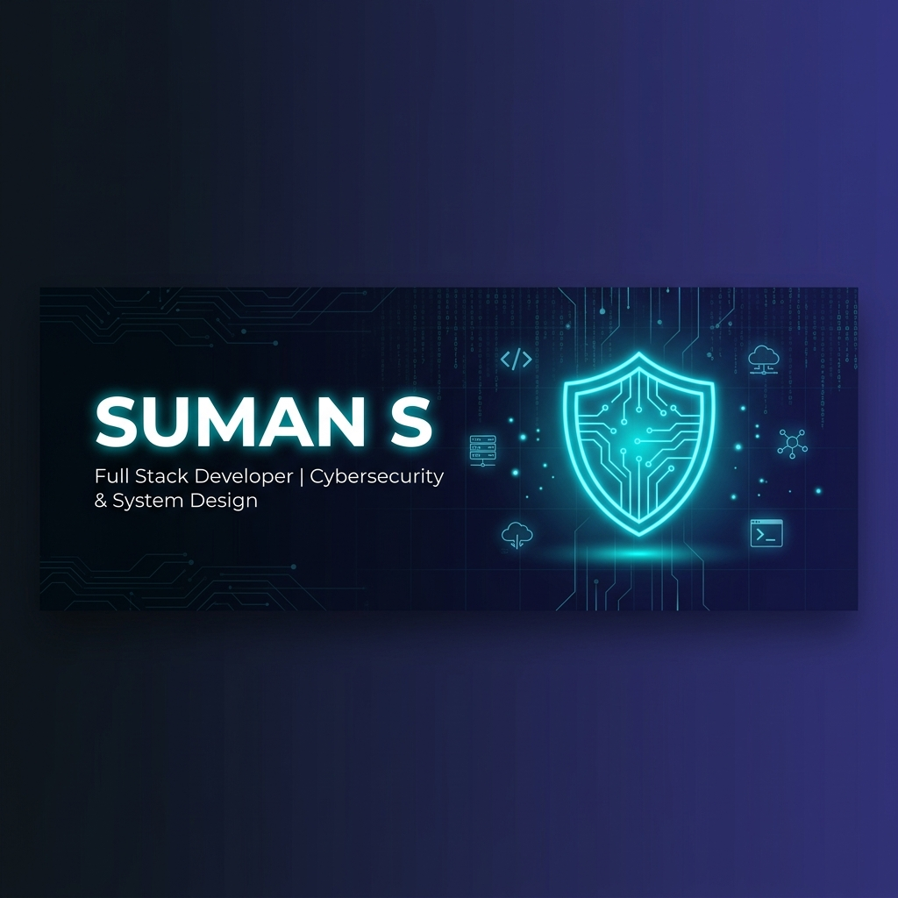

<div align="center">

<!-- ANIMATED HEADER BANNER -->


<!-- ANIMATED TYPING -->
<br>

[](https://git.io/typing-svg)

<br>

<!-- SOCIAL BADGES -->
<a href="https://linkedin.com/in/infosunman"></a>&nbsp;
<a href="https://github.com/sumans-19"></a>&nbsp;
<a href="https://leetcode.com/sumans-19"></a>&nbsp;
<a href="mailto:sumanshanthakumar@gmail.com"></a>&nbsp;

<br>


</div>

<!-- ANIMATED WAVE SEPARATOR -->


<!-- ═══════════════════════ ABOUT ME ═══════════════════════ -->

##  &nbsp;About Me


```yaml
Name:       Suman S
Location:   Mysuru, Karnataka, India 📍
Education:  B.E. Computer Science (Ongoing)
            VVCE, Mysuru | CGPA: 9.59 🎓
Focus:      Cybersecurity & System Design 🛡️
Role:       GDG-VVCE On-Campus Organizer 🚀
Status:     Open to Opportunities ✨
```

- 🔭 &nbsp;Building **scalable systems** & **secure architectures**
- 🛡️ &nbsp;Passionate about **Cybersecurity** & **Threat Detection**
- 🏆 &nbsp;**AI/ML HackAIthon 2025 Winner** & **Infothon 2025 Champion**
- 🛰️ &nbsp;**ISRO Hackathon** participant — Crater Detection on Moon
- 💡 &nbsp;Solved **150+ LeetCode** problems in DSA
- 🌱 &nbsp;Currently mastering **Cloud Native** & **DevOps** pipelines
- 📫 &nbsp;Reach me at **sumanshanthakumar@gmail.com**

<br clear="both">

<!-- ANIMATED LINE -->


<!-- ═══════════════════════ TECH STACK ═══════════════════════ -->

##  &nbsp;Tech Arsenal

<div align="center">

<table>
<tr>
<td align="center" width="50%">

### 💻 Programming Languages
<br>


</td>
<td align="center" width="50%">

### 🎨 Frontend
<br>


</td>
</tr>
<tr>
<td align="center" width="50%">

### ⚙️ Backend & Databases
<br>


</td>
<td align="center" width="50%">

### ☁️ Cloud & DevOps
<br>


</td>
</tr>
<tr>
<td align="center" colspan="2">

### 🖥️ Operating Systems & Tools
<br>


</td>
</tr>
</table>

</div>

<!-- ANIMATED LINE -->


<!-- ═══════════════════════ ACHIEVEMENTS ═══════════════════════ -->

##  &nbsp;Achievements & Highlights

<div align="center">

<table>
<tr>
<td align="center" width="25%">
<br>
<b>AI/ML HackAIthon</b><br>
<sub>🥇 Winner 2025</sub>
</td>
<td align="center" width="25%">
<br>
<b>Infothon 2025</b><br>
<sub>🥇 Champion</sub>
</td>
<td align="center" width="25%">
<br>
<b>DevOps Hackathon</b><br>
<sub>🏅 Victory</sub>
</td>
<td align="center" width="25%">
<br>
<b>ISRO Hackathon</b><br>
<sub>🌕 Crater Detection</sub>
</td>
</tr>
<tr>
<td align="center" width="25%">
<br>
<b>LeetCode</b><br>
<sub>⚡ 150+ Problems Solved</sub>
</td>
<td align="center" width="25%">
<br>
<b>CGPA</b><br>
<sub>📊 9.59 / 10.0</sub>
</td>
<td align="center" width="25%">
<br>
<b>GDG-VVCE Lead</b><br>
<sub>🚀 On-Campus Organizer</sub>
</td>
<td align="center" width="25%">
<br>
<b>Projects</b><br>
<sub>🔥 10+ Deployed</sub>
</td>
</tr>
</table>

</div>

<!-- ANIMATED LINE -->


<!-- ═══════════════════════ PROJECTS ═══════════════════════ -->

##  &nbsp;Featured Projects

<div align="center">

<a href="https://github.com/sumans-19">

</a>

</div>

<br>

<div align="center">

| 🚀 Project | 📋 Description | 🛠️ Tech Stack |
|:---:|:---|:---:|
| **🖥️ ZeroSetup OS** | Generating temporary laboratory containers for instant dev environments | `Docker` `Linux` `Cloud` |
| **📚 PrepFlash** | AI-powered interview preparation platform with flashcards & questions | `React` `Node.js` `AI/LLM` |
| **⚡ Electricity Billing** | Paid enterprise billing system with automated meter reading | `Java` `MySQL` `Spring` |
| **🏰 Labyrinth Forge** | Dynamic threat simulation platform for cybersecurity training | `Python` `Flask` `Security` |
| **👻 Ghost OS** | Stealth operating system with advanced threat detection capabilities | `C` `Linux` `Kernel` |
| **🤖 AI-LLM** | Custom large language model integration for intelligent applications | `Python` `ML` `NLP` |
| **🛰️ ISRO Crater Detection** | YOLO-based crater detection on lunar surface imagery | `Python` `YOLO` `CV` |

</div>

<!-- ANIMATED LINE -->


<!-- ═══════════════════════ GITHUB STATS ═══════════════════════ -->

##  &nbsp;GitHub Analytics

<div align="center">


<br>


</div>

<br>

<!-- ACTIVITY GRAPH -->
<div align="center">
  
[](https://github.com/sumans-19)

</div>

<!-- ANIMATED LINE -->


<!-- ═══════════════════════ WHAT I DO ═══════════════════════ -->

##  &nbsp;What I Do

<div align="center">

```
╔══════════════════════════════════════════════════════════════════════╗
║                                                                      ║
║   🛡️  CYBERSECURITY        →  Secure Coding · Threat Detection       ║
║                                System Hardening · Penetration Testing ║
║                                                                      ║
║   🏗️  SYSTEM ARCHITECTURE  →  Microservices · Scalable Solutions     ║
║                                Database Optimization · API Design     ║
║                                                                      ║
║   💻  FULL-STACK DEV       →  Web Apps · Mobile Dev · Real-time      ║
║                                Systems · Performance Optimization     ║
║                                                                      ║
║   ☁️  CLOUD & DEVOPS       →  Docker · Kubernetes · CI/CD           ║
║                                Infrastructure as Code · Jenkins       ║
║                                                                      ║
║   🤖  AI/ML INTEGRATION   →  Machine Learning · LLM Integration     ║
║                                Computer Vision · Data Analysis        ║
║                                                                      ║
╚══════════════════════════════════════════════════════════════════════╝
```

</div>

<!-- ANIMATED LINE -->


<!-- ═══════════════════════ EXPERIENCE ═══════════════════════ -->

## 💼 &nbsp;Professional Experience

<div align="center">

```
┌─────────────────────────────────────────────────────────┐
│  🏢  Software Development Consultant                    │
│  ├── 📌 Multiple enterprise-level projects              │
│  ├── 🔧 Full-stack development (scalability focus)      │
│  ├── 📐 Technical architecture & optimization           │
│  └── ✅ Requirements analysis & quality assurance       │
│                                                         │
│  🎓  GDG-VVCE On-Campus Organizer & Lead               │
│  ├── 👥 Leading 500+ community members                  │
│  ├── 🎤 Organizing tech talks & workshops               │
│  └── 🌐 Building developer ecosystem at VVCE            │
└─────────────────────────────────────────────────────────┘
```

</div>

<!-- ANIMATED LINE -->


<!-- ═══════════════════════ CONNECT ═══════════════════════ -->

##  &nbsp;Let's Connect

<div align="center">

<a href="https://linkedin.com/in/infosunman"></a>&nbsp;&nbsp;
<a href="https://github.com/sumans-19"></a>&nbsp;&nbsp;
<a href="https://leetcode.com/sumans-19"></a>&nbsp;&nbsp;
<a href="mailto:sumanshanthakumar@gmail.com"></a>&nbsp;&nbsp;

<br><br>

📍 **Mysuru, Karnataka, India** &nbsp;|&nbsp; 📞 **+91 7483907615** &nbsp;|&nbsp; ✉️ **sumanshanthakumar@gmail.com**

<br>

### 🤝 Open For

`🏢 Full-time Opportunities` &nbsp; `🤝 Collaborations` &nbsp; `💡 Technical Consulting` &nbsp; `📖 Mentoring` &nbsp; `🌐 Open Source` &nbsp; `💼 Freelance`

</div>

<!-- ANIMATED LINE -->


<!-- ═══════════════════════ FOOTER ═══════════════════════ -->

<div align="center">

<br>


<br><br>

<!-- SNAKE ANIMATION -->
<picture>
  <source media="(prefers-color-scheme: dark)" srcset="https://raw.githubusercontent.com/platane/snk/output/github-contribution-grid-snake-dark.svg" />
  <source media="(prefers-color-scheme: light)" srcset="https://raw.githubusercontent.com/platane/snk/output/github-contribution-grid-snake.svg" />
  
</picture>

<br><br>

**Last Updated:** June 2026 &nbsp;|&nbsp; **Status:** Open to Opportunities ✨

<br>


</div>